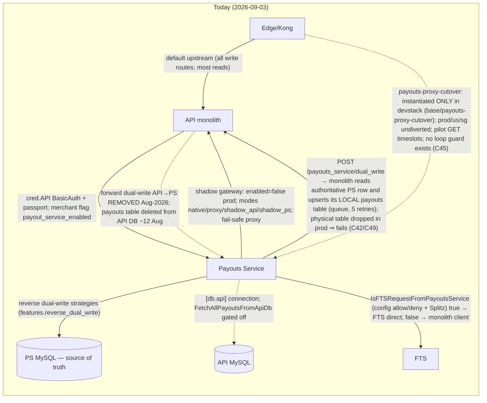
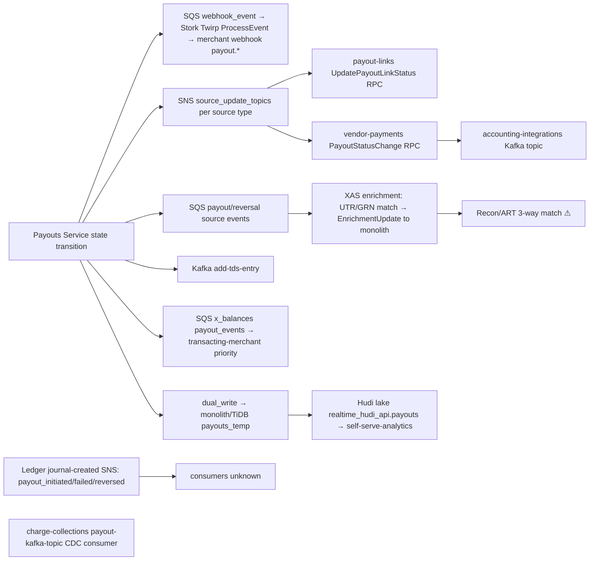

# PAYOUTS_FLOW_CATALOG — RazorpayX Business Banking Plus Payouts

Version 2026-09-04.v2 (post-access delta applied; see ARCHITECTURE_DELTA.md §(d)). All file references are to the default-branch commits recorded in `PAYOUTS_SERVICE_GRAPH.json` (`payouts@4bf3dbf9`, `fts@2a09e763`, `ledger@471ff4d5`, `cfa@d488558e`, `x-balances@1a21c0f9`, `x@40b093f9`, `xperience@88729560`, `x-account-statements@e73fd5ae`). Confidence labels: **confirmed** (read in source), **probable** (source plus corroboration), **inferred** (one side of a boundary only), **unknown**.

Legend for control points: `[AUTH]` authenticate/authorize, `[REJ]` can reject, `[XFORM]` transforms request, `[PERSIST]` owns state, `[REV]` can reverse/compensate, `[ROUTE]` routing decision, `[OBS]` observe only.

---

## Flow A — Dashboard single payout (current merchant path)

```mermaid
sequenceDiagram
    autonumber
    participant U as Dashboard user (cookie session)
    participant X as x SPA (x.razorpay.com)
    participant EDGE as Edge/Kong (terraform-kong, readable since 2026-09-04)
    participant API as API monolith (razorpay/api, readable since 2026-09-04)
    participant AZ as AuthZ (policies, readable)
    participant PS as Payouts Service
    participant DCS as DCS (readable)
    participant CFA as CFA
    participant XB as x-balances
    participant SH as Shield (sdk readable)
    participant WFS as Workflow Service (razorpay/workflows, readable)
    participant LG as Ledger
    participant FTS as FTS
    participant MZ as Mozart (readable; -mock mode) → Bank
    participant ST as Stork (readable) → merchant webhook

    U->>X: create payout (route gated by CREATE_PAYOUT, client-side only)
    X->>EDGE: POST dashboard.razorpay.com/merchant/api/live/payouts_with_otp (cookie + X-CSRF-TOKEN [+X-Payout-Idempotency if experiment on])
    EDGE->>API: route to monolith (default upstream); upstream-jwt mints passport
    API->>API: authenticate: MerchantIpFilter IP allowlist + OTP mandatory for payouts_with_otp; merchant_users membership NOT checked in api (trusts Edge passport) [AUTH] — confirmed (findings/20 §3)
    API->>AZ: dashboard route runs Kong authz-enforcer (enforced) against xplatform policies; public API route is shadow-mode + whitelisted (C44) [AUTH] — confirmed (findings/21)
    API->>PS: POST /v1/payouts — two coexisting proxy gates: Splitz DirectToPayoutsServiceGate (X-Payouts-Service-Proxy: 0, no monolith logic) or classic path (validation/balance/pricing in monolith first, X-Payouts-Service-Proxy: 1); service BasicAuth cred.API + passport (no authType claim; legacy auth type derived by PS) [AUTH][ROUTE] (findings/20 §2, 21 §2)
    PS->>PS: IdempotencyKey middleware: mutex + idempotency_keys UNIQUE(key, merchant_id) [REJ]
    PS->>PS: ValidatePayoutCreateInput (currency/channel, mode, amount) [REJ]
    PS->>DCS: merchant features (30-min Redis-cached MerchantConfig) [ROUTE]
    PS->>CFA: GET fund account / contact (BasicAuth, merchant_id-scoped) [XFORM]
    PS->>SH: risk rule evaluate (200 ms timeout) [REJ]
    PS->>PS: IsWorkflowApplicable (baseHelper.go:107) [ROUTE]
    alt workflow applicable
        PS->>WFS: Twirp WorkflowAPI/Create with callbacks /v1/workflow/state, /payouts_internal/{id}/approve|reject
        PS-->>API: 200 status=pending → see Flow C
    else no workflow
        PS->>XB: ListAccounts (source account selection / MAR) [ROUTE]
        alt Shared / VA balance (ledger-backed)
            PS->>PS: state ledger_response_awaited
            PS->>LG: Journal.Create payout_initiated (sync Twirp, BasicAuth auth.payouts, tenant X) [REJ][PERSIST]
            LG->>LG: atomic UPDATE accounts SET balance … WHERE balance+inc>=min_balance → ErrInsufficientBalance ⇒ queued if queue_if_low_balance else failed
        else Direct / current account
            PS->>PS: queueingstrategy gate: balance_buffer or Redis in-flight reservation (DCS in_flight_reservation_enabled) [REJ]
        end
        PS->>PS: state created (payout_initiated ledger event mapped in status.go:52-64)
        PS->>FTS: POST /v1/transfer (BasicAuth users.ps, X-Origin: payouts) [PERSIST] — only when IsFTSRequestFromPayoutsService true; else via monolith client (legacy)
        FTS->>FTS: idempotent on (source_id, source_type); transfer_meta.origin_service=payouts
        PS->>PS: state initiated (self-loop allowed for retries)
        FTS->>MZ: transfer_init (BasicAuth, 180 s) [ROUTE][XFORM]
        MZ-->>FTS: envelope {data,error,external_trace_id,mozart_id,success,next} — FTS derives processed/failed/retry/pending locally from bank_status_code (error_code.go maps)
        FTS->>PS: POST /v1/payouts/transfer_status_webhook (3×200 s retries, no DLQ) — see Flow I
        PS->>PS: mutex + AllowedStateTransitionForTransferWebhook (fromState ∈ {initiated,processed,reversed,failed} else silent 200 skip)
        PS->>LG: payout_processed (async job for Shared; none for Direct until BAS linking)
        PS->>ST: payout.processed / payout.updated (Twirp, via SQS webhook_event job) [OBS]
        PS->>PS: SNS source_update, SQS XAS source event, Kafka add-tds-entry
    end
    X->>EDGE: GET /payouts (dashboard polls) → API → PS GET /v1/payouts/:id (replica DB)
```

| Question | Answer | Evidence | Confidence |
|---|---|---|---|
| Entrypoint | `POST /merchant/api/{mode}/payouts_with_otp` on `dashboard.razorpay.com` from `x` | `x/src/js/api/outflow.js:83-90`, `api.js:173` | confirmed |
| Authoritative merchant identity | Passport JWT minted at Edge; for proxy auth PS reads `ImpersonationClaims().Consumer`, fallback `x-merchant-id` header | `payouts/internal/auth/passport.go:173-208`, `authHelper.go:12-25` | confirmed |
| Who can reject/transform | Monolith authenticate + role check (inferred); PS idempotency, validation, Shield, workflow gate, balance gate; Ledger insufficient balance; FTS duplicate/bank errors | lanes 01, 02, 04, 12, 15 | confirmed (PS side), inferred (monolith) |
| State owners | Payout: PS MySQL `payouts` (monolith copy deleted Aug-2026); money: Ledger Postgres; transfer: FTS MySQL; beneficiary: CFA Mongo (MySQL fallback) | 01 #19, 04, 03 §7, 05 | confirmed |
| Valid transitions | see `PAYOUTS_ARCHITECTURE.md` state table (`state_machine.go`) | 01 state table | confirmed |
| Idempotency | PS `X-Payout-Idempotency` + `idempotency_keys`; FTS `(source_id, source_type)`; Ledger `(transactor_id, transactor_event)` app-level mutex, no unique index | 01 #9-10; 03 §2; 04 | confirmed |
| Limits / approval | Workflow applicability from DCS flags (dual-named); limits: mode/currency validation, Shield, merchant balance buffer, FTS per-bank amount thresholds | 12 A; 15 | confirmed |
| Tenant isolation | Passport claim → merchant_id; DB scoping is per-query (public GET/cancel scoped; internal approve/reject/reversal lookups unscoped by ID with TODO) | 12 G | confirmed |
| Downstream that can reverse | FTS webhook `reversed`/`failed`; admin force status (monolith); XAS BAS-recon route `banking_account_statement/payout_update`; ledger ForceUpdateBalance | 13; 08; 04 | confirmed |
| Timeout | Ledger 200 ms ×3 + Hystrix; FTS create 1 s ×3; Shield 200 ms; FTS→bank 180 s; FTS webhook 3×200 s then abandon | 02 client table; 03 §4 | confirmed |
| Retry | PS SQS jobs 3 retries/120 s; FTS per-bank backoff tables; ledger failure → async job (3) | 02; 03 §6; 13 | confirmed |
| Duplicate / out-of-order | PS per-payout mutex + terminal-repeat no-op; FTS no ordering; Stork no ordering (processed before updated observed); Ledger no sequence gate | 13 #3-5; 03 §4; 11 E; 04 | confirmed |
| Monolith vs PS disagree | PS DB is source of truth since Aug-2026; reverse dual-write to monolith/TiDB chronically failing (RZPX-144) → dashboard reads that go via TiDB may lag | 11 A | probable |
| Merchant-visible final | `processed`/`reversed`/`failed` via dashboard fetch and `payout.*` webhooks (docs say treat processed/reversed as terminal) | 09 §6-7 | confirmed |
| Financially authoritative | Ledger (tenant X) for Shared/VA; bank via Mozart for Direct (x-balances is a polled mirror) | 04; 06; 11 G | confirmed |
| Eventually consistent | TiDB/payouts_temp copy, ES index, XAS enrichment, ledger async VendorPayable/GST accounts, x-balances polled balance | 02; 04; 08 | confirmed |
| Compensating actions | payout_failed/payout_reversed journals; reservation release hook; admin manual_action; ledger ForceUpdateBalance; manual ledger replay | 04; 12 B/F; 08 | confirmed |
| Live-config-dependent | DCS workflow flags, Splitz (route mode, FTS origin, Kafka vs HTTP, idempotency enforcement, dual-write push), Kong route templates, authz policies | 01; 02; 03; 11 | confirmed |

---

## Flow B — Public API payout

```mermaid
sequenceDiagram
    autonumber
    participant M as Merchant integration (key_id:secret)
    participant EDGE as Edge/Kong ⚠
    participant API as API monolith ⚠
    participant PS as Payouts Service
    participant CFA as CFA
    participant LG as Ledger
    participant FTS as FTS
    participant ST as Stork ⚠

    M->>EDGE: POST api.razorpay.com/v1/payouts (Basic Auth, X-Payout-Idempotency, account_number, fund_account_id, amount, mode, purpose, queue_if_low_balance)
    EDGE->>API: basic-auth-x → consumer; upstream-jwt passport authType=private
    API->>PS: POST /v1/payouts (cred.API BasicAuth + passport private) — proxy layer; PS shadow-gateway would intercept if enabled (prod: disabled)
    PS->>PS: RequestDecrypter (AES-GCM, HVault key) only for private auth + DCS encryption feature
    PS->>PS: idempotency (7-day safe retry per docs; request_hash mismatch ⇒ BAD_REQUEST)
    PS->>PS: TranslateAccountNumberToBalanceId (x-balances) [XFORM]
    PS->>CFA: fund account fetch (FAV freshness gate per ValidX spec) [REJ]
    PS->>PS: IsWorkflowApplicable — skip_approval_workflow_for_api applies only to private auth
    PS->>LG: payout_initiated (Shared) or balance gate (Direct)
    PS->>FTS: /v1/transfer … (as Flow A)
    FTS-->>PS: transfer_status_webhook
    PS->>ST: payout.initiated / processed / reversed / failed / updated
    M->>EDGE: GET /v1/payouts/{id} (status fetch; GET routed to replica)
```

Differences from Flow A: identity is `ConsumerClaims().consumer.id` (private auth); payload encryption middleware applies; `skip_approval_workflow_for_api` semantics; `payout.*` webhooks are the merchant-visible channel and are documented as unordered. Edge→PS direct routing for write routes is not yet live (Kong template is a shadow route with monolith default upstream, 2026-09-03).

---

## Flow C — Maker-checker / approval

```mermaid
sequenceDiagram
    autonumber
    participant Maker as finance_l1 (dashboard)
    participant API as API monolith ⚠
    participant PS as Payouts Service
    participant WFS as Workflow Service (razorpay/workflows, readable) (workflows.*.razorpay.*)
    participant Checker as finance_l2/l3 (dashboard, OTP / bank 2FA)
    participant AZ as AuthZ ⚠

    Maker->>API: POST payouts_with_otp
    API->>PS: POST /v1/payouts
    PS->>PS: IsWorkflowApplicable: purpose=RzpFees/internal contact/PayoutWorkflows feature (dual name payout_workflows vs enable_payout_workflow, OR'd only when Splitz PayoutWorkflowsDcsNameExperiment)/SkipWorkflow(PAYOUT_LINKS)/XPERIENCE/batch
    PS->>WFS: WorkflowAPI/Create (callbacks: /v1/workflow/state[/:id], /payouts_internal/{id}/approve|reject via service name payouts_live)
    PS->>PS: OnEvent(pending); workflow_entity_map; payout_logs; webhook payout.pending
    Checker->>API: POST /payouts/{id}/approve (+OTP) or /payouts/approve/2fa (ICICI bank 2FA)
    API->>AZ: APPROVE_PAYOUT permission [AUTH] — inferred
    API->>WFS: action on workflow (inferred)
    WFS->>PS: PATCH /v1/workflow/state/:id (BasicAuth cred.Workflow) → workflow_state_map (+ best-effort forward to monolith)
    WFS->>PS: POST /v1/payouts/payouts_internal/{id}/approve (BasicAuth only; unscoped FindByID; returns 200 even on error to stop WFS retries)
    PS->>PS: ProcessApprovePayout → re-enters post-create pipeline (Flow A step 15 onward)
    alt reject
        WFS->>PS: POST .../reject → EventRejected (pending→rejected), no ledger
    end
    Note over PS: No expiry callback from WFS ever (Cadence timeout only, min ~4 months if set, default ~10 y). The 3-month auto-reject is a separate monolith cron payouts_auto_cancel_on_expiry applying to PENDING and QUEUED payouts (findings/23 §A.8, 20 §5)
```

Control points: workflow applicability is decided inside PS from DCS-sourced merchant features cached 30 min in Redis; `UpdateMerchantFeatureInCache` no-ops on cold cache (candidate cause of the recurring "workflow ignored" incidents, Jun–Aug 2026). OTP is enforced in the monolith (mandatory for `payouts_with_otp` and non-partner approvals); WFS itself performs no passport/AuthZ check and trusts caller-supplied actor role fields. Bulk approvals bypass WFS entirely: Batch's `payout_approval` type calls `POST payouts/bulk_approve` on PS in 5-row chunks (findings/23).

---

## Flow D — Bulk payouts

```mermaid
sequenceDiagram
    autonumber
    participant U as Dashboard user (CREATE_PAYOUT_BULK)
    participant X as x SPA
    participant API as API monolith ⚠ (dashboard proxy; batch CRUD still proxied)
    participant XP as Xperience BFF (passport edgev1)
    participant B as Batch service (razorpay/batch, readable)
    participant WFS as Workflow Service (razorpay/workflows, readable)
    participant PS as Payouts Service

    U->>X: upload CSV/XLSX
    X->>API: POST /xperience(-edge)/bulk-payouts/validate (4 API generations coexist: /batches/validate, /payouts/batch/validate, v2 xperience)
    API->>XP: BulkPayoutEdgeAPI/Create (file extension, row count, mandatory headers only)
    XP->>B: create batch → row-level validation (amount, IFSC, account) [REJ] — Batch service not readable
    X->>XP: BulkApprove/BulkReject → WFS (approval on validated set)
    X->>XP: Process → Batch.ProcessBatch
    B->>PS: POST /v1/payouts/bulk (passport, cred.API/Workflow; header X-Batch-Id; per-row caller-supplied idempotency_key)
    PS->>PS: CreateBulkPayoutsConcurrent (2–10 goroutines); bulk_idempotency_keys (merchant_id, key) + mutex; duplicates return existing payout (no batch failure)
    PS->>PS: NEFT/RTGS rows → batch_submitted; cron /process_batch_submitted_payouts releases; IMPS/UPI → normal pipeline
    Note over B,PS: payouts/bulk is synchronous — Batch has per-row outcomes from the response; callers poll Batch's own GET /batch/{id} (no PS polling)
```

Known defect class: classic `payout.json` derives idempotency_key = "batch_"+BatchEntry.id with no Redis mutex (v2 sibling types use SHA1 + RedisMutexLock 300 s) → concurrent re-processing races; Batch's own AGENTS.md claim of a batch-level mutex is not in code (findings/23 §B). Bulk closure differs from single-payout closure: adds Xperience, Batch service, WFS bulk paths, and the monolith dashboard proxy for batch CRUD.

---

## Flow E — queue_if_low_balance and queued payouts

```mermaid
sequenceDiagram
    autonumber
    participant PS as Payouts Service
    participant XB as x-balances
    participant MZ as Mozart (readable; -mock mode) → Bank
    participant R as Redis (reservations)
    participant LG as Ledger
    participant CRON as Cron (external scheduler, cadence unknown)

    PS->>PS: Direct: GetLatestDirectAccountBalance (cache → x-balances → BASD)
    alt DCS in_flight_reservation_enabled
        PS->>R: Lua Reserve({merchant:balance}) after heartbeat check (fail-closed ⇒ queue) [REJ]
    else
        PS->>PS: amount > gatewayBalance − queue_payout_bal_buffer ⇒ queue [REJ]
    end
    PS->>LG: Shared/VA: Journal.Create payout_initiated → ErrInsufficientBalance ⇒ EventQueued (queue flag) or failed
    PS->>PS: state queued (reasons low_balance | fee_recovery_pending | gateway_degraded | beneficiary_bank_down)
    XB->>MZ: per-bank balance polling workers (30-min rotation for non-priority merchants)
    XB->>PS: SQS BalanceRefreshEvent → releases aged reservation holds only
    CRON->>PS: POST /v1/cron/process_queued_low_balance_payouts (FastCron BasicAuth)
    PS->>PS: balances changed in last 6 h → FindQueuedPayoutsForBalanceId (limit 5000, no ORDER BY) → SQS queued_payout job per payout
    PS->>PS: job: mutex payout_<id> 30 s, re-check IsStateQueued, re-run gate → dispatch or stay queued
    CRON->>PS: /process_inflight_reservation_reconciliation every 5 min rebuilds Redis from DB; heartbeat TTL 12.5 min
```

Race handling: pre-reservation era had none (bulk approvals over-committed balance, Jun–Jul 2026). Reservation shipped ~2026-08-29 and currently over-holds for long-pending IMPS deemed-success payouts. No max-retry/expiry ceiling for chronically queued payouts found in PS (docs: queued >3 months auto-failed, owner unknown). Cancel is allowed from queued/scheduled/on_hold and never touches the ledger.

---

## Flow F — Cancellation, failure, reversal

```mermaid
sequenceDiagram
    autonumber
    participant M as Merchant / dashboard
    participant PS as Payouts Service
    participant FTS as FTS
    participant LG as Ledger
    participant ST as Stork ⚠
    participant XAS as XAS
    participant ADM as Admin dashboard → monolith ⚠

    M->>PS: POST /v1/payouts/cancel_payout/:id (passport) → EventCancelled only from queued/scheduled/on_hold; no ledger
    FTS->>PS: webhook status=reversed (Shared: FTS failed is remapped to reversed via FtsToPayoutStatusMap; Direct+RBL: failed→failed)
    PS->>PS: mutex; repo.Transaction{status-details, CreateReversalEntity, EventReversed, update} — DB commit BEFORE ledger
    PS->>ST: payout.reversed
    PS->>LG: TransactionCreationForReversal → payout_reversed (+catch-up payout_processed); on failure enqueue LedgerReversedEventFailureType (3 retries) and return 500 to FTS
    Note over PS,LG: legacy relay path (/update_payouts_with_fts) orders ledger BEFORE DB update — inconsistent with direct path
    FTS->>PS: webhook status=failed → VerifyPayoutFailedTransaction (refuse if TransactionID set or XAS debit statement matched) → EventFailed or EventReversed per merchant webhook subscription + account type
    PS->>PS: reservation release hook on processed/failed/reversed/cancelled/rejected
    XAS->>PS: BAS-recon route /banking_account_statement/payout_update can create reversal entity (Direct accounts)
    ADM->>PS: force status (monolith → PS) — monolith creates reversal entity before ledger; force_update path skips ledger-success check (known ordering bug, manual ledger replay required)
    LG->>LG: payout_reversed/payout_failed credit MerchantBalance(amount+commission), debit Commission/GST/FtsReceivable
```

Compensation inventory: ledger `payout_failed`/`payout_reversed` mirror entries; async retry jobs (3) then `MovePayoutToTerminalStateAsPerWebhookConfig` backstop; manual ledger replay by ledger team (needs correct `fts_fund_account_id`); admin `manual_action processed_to_processing` (raw DB write bypassing state machine and ledger); ledger `ForceUpdateBalance`. No PS admin action forces a stuck `initiated` payout to failed/reversed from FTS truth.

---

## Flow G — API-monolith vs Payouts-Service decomposition / routing



| Question | Answer | Evidence |
|---|---|---|
| Routing decision | Kong route → monolith default; per-route Kong template + PS shadow gateway (Splitz per merchant) for cutover; inside PS, `IsFTSRequestFromPayoutsService` decides FTS call origin | 01 #2-7; 11 A/B; 13 #15 |
| Feature flags | `shadow_gateway.enabled`, per-route Splitz experiments, merchant `payout_service_enabled`, `ForDualWriteDirectPushToAPI`, `features.{forward,reverse}_dual_write`, `fts_request_from_payouts_service_experiment` | 01; 02 §6 |
| Proxy path | Edge→API→PS today; PS→API `monolith_base_url=prod-api-int.razorpay.com` for proxy/shadow legs; PS-side loop guard `X-PS-Proxied` exists in PS shadow gateway only — no Edge/Kong loop guard (C45) | 01 #2-4 |
| Dual-write | PS→monolith/TiDB async (SQS) — failing; API→PS removed; CFA→API SQS 30 s; x-balances/banking-accounts legacy writes into API balance table | 02 §6; 05; 06; 11 A |
| Source of truth | PS MySQL for payout entity; Ledger for money (X); FTS for transfer; API DB still for balance (legacy merchants), contacts/fund_accounts list queries | 11 A; 04; 05 #58; 06 |
| CDC | None for payouts→API (app-level dual write); XAS binlog CDC to monolith; Hudi lake CDC for analytics; ledger PG-tenant CDC unrelated | 08; 11 A |
| Fallback | Shadow gateway fail-safe = proxy to monolith; x-balances/cfa API-DB read fallback; PS `db.api` gated off | 01 #3,#20; 05; 06 |
| Migration/admin action | `/v1/payouts/free_payout_migration`, `/consistency_checker`, `ManualAction dual_write`, cron `reverse_dual_write`, `payouts_dual_write_failure_processing` | 02 §5-6 |
| Rollback | Shadow gateway `enabled=false` / Splitz weight 100% proxy; Kong route rollback (PR 11047 restored dev rollout knob) | 01 #5; 11 |
| Final consistency | Dashboard/TiDB/Data-lake views can lag PS truth while reverse sync is broken; merchants see PS truth via fetch-by-id | 11 A (2026-08-21) |

---

## Flow H — Downstream lifecycle



Consumers that can change behaviour: XAS (creates statement→payout link; BAS-recon route can create reversal entities for Direct accounts); Recon/ART (drives manual repair); admin tooling. Observe-only: analytics, accounting-integrations, x-balances priority counters. Webhook ordering: none (Stork, documented).

---

## Flow I — Bank/provider interaction (FTS)

```mermaid
sequenceDiagram
    autonumber
    participant PS as Payouts Service
    participant FTS as FTS web
    participant W as FTS workers (machinery/Redis)
    participant MZ as Mozart ⚠
    participant BK as Bank (ICICI/Axis/RBL/IDFC/Yes/HDFC/Citi/M2P/…)
    participant API as API monolith ⚠

    PS->>FTS: POST /v1/transfer (preferred channel/mode, source account, beneficiary) — idempotent (source_id, source_type) under mutex
    FTS->>FTS: routingv2 mode/route selection (MAR, channel health, congestion, downtime, per-bank amount thresholds/TPS) [ROUTE]
    FTS->>W: initiate_transfer task
    W->>MZ: gateway_auth/session (cached token) then transfer_init (Basic Auth, 180 s)
    MZ->>BK: bank protocol (REST/SOAP/SFTP; direct SFTP for Axis/JPMC/ICICI OPGSP/RBL MC)
    BK-->>MZ: response / async
    W->>W: FSM: CREATED→INITIATED→{PROCESSED|FAILED|USER_PENDING}; RETRY; PROCESSED→REVERSED
    W->>MZ: check_transfer_status / verify_transfer_status polling (per-bank backoff tables keyed by error code)
    Note over W: ambiguous handling: CBS:188/7161/proxy-401 with UTR ⇒ stay pending; duplicate txn ⇒ skip update to avoid double pay; duplicate gateway_ref_no ⇒ fail
    W->>W: UTR captured on attempt then transfer (race with webhook body — payouts#1872)
    alt origin_service==payouts && Splitz CreateTransferMetaRollout
        W->>PS: POST /v1/payouts/transfer_status_webhook (3×200 s; give up: log+metric only)
    else
        W->>API: POST /v1/update_fts_fund_transfer (legacy) → FundTransferAttemptController@updateSource: FTA row committed first, then single-attempt PATCH PS /update_payouts_with_fts (no retry, re-throws) (findings/20 §4)
    end
    opt Splitz FireStatusUpdateKafka
        W->>PS: Kafka rx-fts-status-update-events (PS drops reversed/failed)
    end
    W->>W: stuck_payouts cron (INSTANCE_TYPE=canary, leader-elected) re-drives stuck transfers/attempts
    FTS->>PS: /v1/notify/health/update, /v1/notify/downtime (partner bank health → on_hold)
```

Delayed success / ambiguous status / reconciliation: handled inside FTS by UTR gating and status-check policies; reconciliation against bank statements is XAS + Recon/ART, not FTS. Duplicate responses: transfer-level dedupe and `FtsDuplicateGatewayRefNo`.

---

## Additional variants discovered

| Variant | Entry | Distinct closure elements | Evidence |
|---|---|---|---|
| Payout links | payout-links → monolith `payouts_internal` (Basic Auth); payee page in frontend-x via public API + OTP | payout-links, Stork, WFS callbacks, SNS source update | 09 |
| Vendor payments / tax payments (TDS) | vendor-payments → `x.razorpay.com/v1/payouts_internal`, `internalContactPayout`, `payouts/2fa/create_internal` | vendor-payments, WFS, TDS module, accounting-integrations | 09 |
| Fee-recovery payouts | charge-collections → `/v1/internalContactPayout` purpose RzpFees, queue_if_low_balance=true; PS skips workflow for RzpFees | charge-collections, Governor | 09; 12 |
| Petty-cash payouts | xperience → monolith `composite_payout_internal` | xperience | 07 |
| Scheduled payouts | `scheduled_at` in 4 IST slots; cron `/process_scheduled_payouts`; still-pending at slot ⇒ auto-reject | PS only | 12 C |
| On-hold (bene bank down IMPS / partner bank down) | Redis bene-bank map (writer unknown) / FTS health webhook; crons dispatch or fail on SLA | PS, FTS | 12 C |
| VA-to-VA / inter-account / reward payouts | separate ledger event families | Ledger seed configs | 04 |
| IRCTC / wallet / settlements | still on API monolith + FTS (SETTLEMENT/WALLET auth); IRCTC settlement via Catalyst/FTS/Ledger CDC in build | out of first scope | 11 A; 03 §2 |
| Partner-OAuth & mobile-number payouts | being deprecated (zero traffic) | none | 11 A |
| Multi-currency (RBL channel only; MYR/Curlec) | `ValidateCurrencyForChannel` | PS | 15 |
