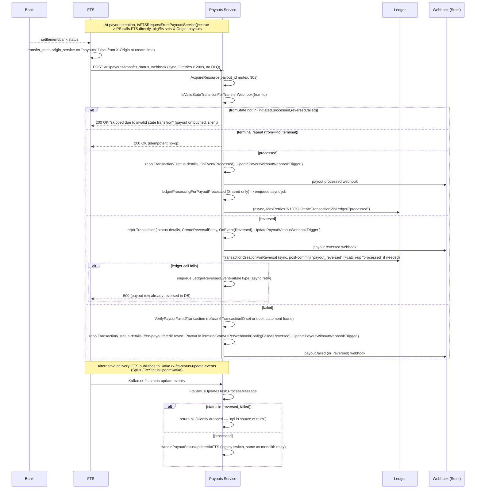
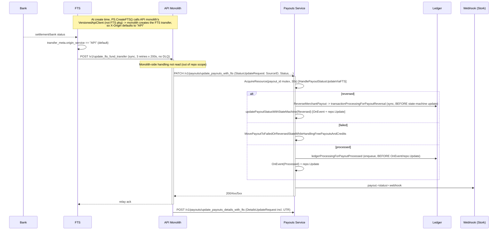

# FTS -> Payouts Service: transfer outcome -> payout outcome (current PS-owned path)

Repos: payouts@4bf3dbf9, fts@2a09e763, ledger@471ff4d5 (read-only, no writes made).

## 1. Findings table

| # | Claim | Repo file:line + symbol | Excerpt (<=6 lines) | Confidence | Capability |
|---|---|---|---|---|---|
| 1 | Route: `POST /v1/payouts/transfer_status_webhook` -> `HandleTransferStatusWebhookForPayout`. Auth = shared BasicAuth for the whole `/v1/payouts` group (cred.API, Workflow, Xperience, **FTS**, VendorPayments, Settlements, Irctc) — no per-route/per-caller check, no signature. | payouts `internal/routing/router/payout_internal_routes.go:12-18,153-158` | `middleware.BasicAuth(cred.API, cred.Workflow, cred.Xperience, cred.FTS, ...)` ... `{http.MethodPost, "/transfer_status_webhook", controllers.PayoutService.HandleTransferStatusWebhookForPayout, nil}` | High (read) | verified |
| 2 | Legacy relay routes in the same group: `PATCH /update_payouts_with_fts` -> `HandlePayoutStatusUpdateViaFTS`, `POST /update_payouts_details_with_fts` -> `HandlePayoutDetailsUpdateViaFTS`. Same shared auth, so **any** cred in the group (incl. cred.API = the monolith) can hit these. | payouts `internal/routing/router/payout_internal_routes.go:26-37` | `{http.MethodPatch, "/update_payouts_with_fts", controllers.PayoutService.HandlePayoutStatusUpdateViaFTS, nil}` | High | verified |
| 3 | `HandleTransferStatusWebhookForPayout` acquires a **per-payout mutex** (`AcquireResource(ResourcePayout+SourceId, 30s)`) before any read/write, released via `defer`. Ordering/idempotency guard #1. | payouts `internal/app/payouts/fts_transfer_status_webhook.go:31,53-84` | `m, err := c.AcquireResource(ctx, fmt.Sprintf(appConstants.ResourcePayout, ...SourceId), 30*time.Second)` | High | verified |
| 4 | Guard #2: `IsValidStateTransitionForTransferWebhook(fromState,toState)` looks up `AllowedStateTransitionForTransferWebhook`. The map **only has entries for `initiated`, `processed`, `reversed`, `failed` as fromState**. Any payout parked in `created`, `create_request_submitted`, `pending`, `scheduled`, `batch_submitted`, `queued`, `on_hold`, `ledger_response_awaited` is **not in the map** -> transition rejected -> handler returns **HTTP 200** with `"webhook update skipped due to invalid state transition"`, payout untouched, only an Info log. | payouts `internal/app/common/appConstants/states.go:37-52`; `internal/app/payouts/fts_transfer_status_webhook.go:122-131` | `AllowedStateTransitionForTransferWebhook = map[string]map[string]bool{StateInitiated:{...}, StateProcessed:{...}, StateReversed:{...}, StateFailed:{...}}` | High | verified |
| 5 | Guard #3 (regression/dup-webhook): if `payout.GetStatus() == status` and status is terminal, handler short-circuits and returns the existing payout — no re-processing, no error. Repeat webhooks for an already-terminal payout are idempotent no-ops that still return 200 to FTS. | payouts `internal/app/payouts/fts_transfer_status_webhook.go:388-394` | `if payout.GetStatus() == status && utils.FindInString(appConstants.TerminalStateForTransferWebhook, status) { ... return payout, nil }` | High | verified |
| 6 | `processed` -> `HandlePayoutProcessedViaFundTransferService`: inside one `repo.Transaction`, creates status-details, fires `payout.OnEvent(EventProcessed)`, then `repo.UpdatePayoutWithoutWebhookTrigger` (payout DB row committed here). **After** the transaction commits, `ledgerProcessingForPayoutProcessed` is called — this only stores an `fts_info` meta row and (for Shared-type accounts only) **enqueues** an async job (`LedgerProcessedEventFailureType`); it does not call ledger synchronously. CA (`Direct`) payouts skip ledger entirely here ("done after BAS linking"). | payouts `internal/app/payouts/fts_transfer_status_webhook.go:744-783,851-854`; `internal/app/payouts/core.go:2532-2598` | `if !strings.EqualFold(bankAcc.GetAccountType(), appConstants.Shared) { return nil }` ... `job.QueuePushForPayoutUpdateFailureHandling(ctx, job.LedgerProcessedEventFailureType, payout.GetID())` | High | verified |
| 7 | Async `payout_update_failure_handling` queue: `MaxRetries: 3`, `Timeout: 120s`, worker-based (no DLQ construct visible in this repo's job config — only the 3 retries). The `ledger_processed_event` case calls `checkIfLedgerAlreadyCreatedOrNot` first (idempotent) then `reversalCore.CreateTransactionViaLedger(...,"processed",...)`. | payouts `internal/job/payout_update_failure_handling.go:32-46`; `internal/app/payouts/asyncFailureHandlingHelper.go:471-513` | `MaxRetries: 3, Timeout: 120 * time.Second` | High | verified |
| 8 | `reversed` -> `HandlePayoutReversedViaFundTransferService`: inside `repo.Transaction`, creates status-details, calls `reversalCore.ReverseMerchantPayoutViaFundTransferServiceReversedWebhook` (creates/finds a `Reversal` entity row), fires `EventReversed`, then `repo.UpdatePayoutWithoutWebhookTrigger` — **DB commit happens before any ledger call**. Only *after* the transaction commits does the handler call `reversalCore.TransactionCreationForReversal`, which synchronously calls Ledger for the `payout_reversed` (and, if the payout skipped `processed`, also a catch-up `payout_processed`) journal. | payouts `internal/app/payouts/fts_transfer_status_webhook.go:1065-1144,1186-1197` | `err = c.reversalCore.TransactionCreationForReversal(ctx, payout, ftsStatusUpdateInfo, reversal)` (called after `repo.Transaction` block, i.e. after payout row is already `reversed` in DB) | High | verified |
| 9 | If that post-commit ledger call fails, `transactionProcessingForPayoutReversal` does **not** roll back the payout status; it stores `fts_info` meta and enqueues `job.LedgerReversedEventFailureType` (new-path) or `job.PayoutReversalFailureType` (legacy) for async retry, then returns the error up. The webhook handler chain (`UpdateReversedStatusWithTransferStatusWebhook` -> `HandleTransferStatusWebhookForPayout`) propagates this error to the controller, which maps any non-{RecordNotFound, BadRequest} error to **HTTP 500**. | payouts `internal/app/reversals/core.go:287-339,171-219`; `internal/controllers/payoutController.go:1517-1531` | `if c.IsFTSRequestFromPayoutsService(ctx, payout) { err = job.QueuePushForPayoutUpdateFailureHandling(ctx, job.LedgerReversedEventFailureType, payout.GetID()); return err }` | High | verified |
| 10 | `failed` -> `HandlePayoutFailedViaFundTransferService`: does an XAS debit/credit statement check (`VerifyPayoutFailedTransaction` — refuses to fail a payout that already has a `TransactionID`, or that has a matching debit bank statement, in which case it errors out and does **not** mark failed), then in one transaction: status-details, free-payout/credit revert bookkeeping, `PayoutToTerminalStateAsPerWebhookConfig` (event = `Failed` **or** `Reversed` depending on merchant's failed-webhook subscription + account type), `repo.UpdatePayoutWithoutWebhookTrigger`. **No explicit ledger call in this function** — for Shared accounts a "failed" FTS status is normally *not* reachable via `GetPayoutStatusFromFtsStatusMapping` (see finding 15) so this path effectively only fires for `Direct`/CA merchants, whose ledger interaction happens later via BAS linking. | payouts `internal/app/payouts/fts_transfer_status_webhook.go:600-652,876-1034`; `internal/app/payouts/core.go:3857-3907` | `if subscribedToFailedWebhook || appConstants.Direct == accountType { event = appConstants.EventFailed } else { event = appConstants.EventReversed; ... reversalCore.CreateReversalEntity(...) }` | Medium (ledger-for-failed inference) | verified+inferred |
| 11 | **The HTTP webhook path does NOT drop reversed/failed** the way the Kafka consumer does — both `HandleTransferStatusWebhookForPayout` (new/direct) and `HandlePayoutStatusUpdateViaFTS` (legacy relay, same switch: `HandlePayoutReversed`/`HandlePayoutFailed`/`HandlePayoutProcessed`/`HandlePayoutInitiated`) process all four statuses. Only the **Kafka** consumer (`FtsStatusUpdatesTask.ProcessMessage`) explicitly returns `nil` (silently acks/drops) for `reversed`/`failed` with the comment that "api is source of truth for reversed status." | payouts `internal/app/payouts/core.go:1465-1517`; `internal/taskHandlers/fts_status_updates.go:56-61` | `if inputStatus == appConstants.StateReversed \|\| inputStatus == appConstants.StateFailed { return nil }` | High | verified |
| 12 | Both `HandleTransferStatusWebhookForPayout` (new) and `HandlePayoutStatusUpdateViaFTS` (legacy) take the **same mutex key** (`ResourcePayout+SourceId`/`SourceID`), so a payout cannot be concurrently processed by the direct-webhook and monolith-relay entry points at once. | payouts `internal/app/payouts/fts_transfer_status_webhook.go:53`; `internal/app/payouts/core.go:1479` | `m, mutexErr := c.AcquireResource(ctx, fmt.Sprintf(appConstants.ResourcePayout, request.SourceID), 30*time.Second)` | High | verified |
| 13 | Ordering **inconsistency** between the two entry points for `processed`/`reversed`: legacy `HandlePayoutProcessed`/`HandlePayoutReversed` (called from `/update_payouts_with_fts`) call the ledger-enqueue/ledger-create step **before** `payout.OnEvent`+`repo.Update`; the new `...ViaFundTransferService` variants (direct webhook) do DB update first, ledger step after. Both are still same-request-synchronous vs. async-retry on failure, but the ordering of "DB write" vs "ledger call/enqueue" is flipped between the two code paths for the same conceptual transition. | payouts `internal/app/payouts/core.go:2340-2360(legacy reversed),2444-2470(legacy processed)` vs `internal/app/payouts/fts_transfer_status_webhook.go:744-783(new processed),1065-1144(new reversed)` | `err = c.ledgerProcessingForPayoutProcessed(...); if err != nil {...}; if eventErr := payout.OnEvent(...)` (legacy, ledger-enqueue first) | Medium | verified+inferred |
| 14 | Outbound: Payouts Service sets `X-Origin: payouts` on every FTS call it makes directly. This is the header FTS's `FireTransferStatusWebhook` (fts repo, per task KNOWN baseline) reads to decide direct-to-Payouts-Service vs monolith delivery. | payouts `pkg/fts/base.go:95`; `pkg/fts/client.go:32` | `headers[HeaderXOrigin] = Payouts` | High | verified |
| 15 | Whether Payouts Service calls FTS directly (setting that header) vs. relaying the *create* through the API monolith is gated by `Core.IsFTSRequestFromPayoutsService` (config allow/deny-list, else Splitz experiment `fts_request_from_payouts_service_experiment`). When true: `FundTransferServiceProcessing` -> `processor.FundTransfer` -> imports `payouts/pkg/fts` directly. When false: `processorFactory...CreateFTS(&payout)` -> `processor.makeFTSRequest` -> `provider.GetVersionedApiClient(ctx)` (the **API-monolith HTTP client**), i.e. the legacy path asks the monolith to talk to FTS, which is what makes the monolith the FTS webhook target and the source of the `/update_payouts_with_fts` relay. | payouts `internal/app/payouts/core.go:5847-5858,5931-5970`; `internal/app/payouts/processor/payoutFTS.go:18-86`; `internal/app/payouts/processor/fund_transfer_service.go:19,24` | `if c.IsFTSRequestFromPayoutsService(ctx, &payout) { ftsErr := c.FundTransferServiceProcessing(...) ... } ...CreateFTS(&payout)` (legacy branch) `res, err := makeFTSRequest(...)` -> `apiClient := provider.GetVersionedApiClient(ctx)` | High | verified |
| 16 | `FtsToPayoutStatusMap`: for `default`/`Shared` accounts, FTS `failed` is mapped to Payouts status **`reversed`**, not `failed`; only `Direct`+`RBL` (and presumably other Direct channels) map FTS `failed` -> Payouts `failed` 1:1. So "FTS failed" for a Shared-account payout is expected to land as Payouts `reversed`, going through `HandlePayoutReversedViaFundTransferService` (which does call ledger, finding 8), not the failed handler. | payouts `internal/app/common/appConstants/states.go:60-90` | `Shared: {"default": {..., StateFailed: StateReversed, StateProcessed: StateProcessed}}` vs `Direct: {RBL: {..., StateFailed: StateFailed, ...}}` | High | verified |
| 17 | **No FTS-status polling / reconciliation for stuck `initiated` payouts exists in this repo.** `pkg/fts` only exposes create-side requests (`GetFTSTransferRequest`, `GetModeSelectionRequest`, `GetMultiAccountRouteSelectionRequest`) — no `GET /v1/transfer` / `transfer/status` client method. The only stuck-payout cron (`SLAMonitor.CheckSLABreaches` -> `MonitorStuckPayouts` -> `MonitorStuckPayoutsByStatus`/`MonitorScheduledStuckPayouts`) covers **only** `batch_submitted`, `create_request_submitted`, `scheduled` — **`initiated` is not a monitored status** — and even for the statuses it does cover, the action is Slack-alert + Prometheus gauge only, **no repair, no FTS callback**. | payouts `pkg/fts/*.go` (grep, no GET-status method); `internal/app/payouts/service.go:885-935`; `internal/config/config.go:585-597`; `internal/app/payouts/core.go:10324-10382` | `type StuckPayoutsMonitoringConfig struct { Enabled bool; CreateRequestSubmitted ...; BatchSubmitted ...; Scheduled ... }` (no `Initiated` field) | High | verified |
| 18 | `InitiateDataConsistencyChecker` (`/v1/payouts/consistency_checker`, cron-callable) and `PayoutsDualWriteFailureProcessing` are the only other consistency crons found; neither's name/signature indicates an FTS-status-vs-payout-status comparison — not read in full (out of budget), flagged as unresolved (#Q1 below). | payouts `internal/app/payouts/service.go:833-845` | `func (s *Service) InitiateDataConsistencyChecker(ctx context.Context) (interface{}, errors.IError) { ... s.Core.InitiateDataConsistencyChecker(ctx) ... }` | Low (not traced into Core impl) | unresolved |
| 19 | `Ledger` config (`auth.payouts`, `auth.fts`) — both Payouts Service and FTS hold independent BasicAuth credentials against Ledger, so both are architecturally capable of calling Ledger directly. | ledger `config/default.toml:143,~152,~155` (secrets redacted; only usernames + presence confirmed) | `[auth.fts] username = "fts_key" password = [REDACTED]` / `[auth.payouts] username = "payouts_key" password = [REDACTED]` | High (structure), secret values never read | verified |
| 20 | Despite having Ledger auth, **FTS only uses its Ledger credential for `CreateOnEvent` account provisioning** (`LedgerCreateAccountOnEventRequest` — ledger *account* creation for fund/bank accounts), not for transaction journals. No `payout_processed`/`payout_failed`/`payout_reversed` journal-creation code found in the fts repo. | fts `internal/account/ledger_request.go:18-48`; `internal/account/service.go`; `internal/tasks/ledger_account_create.go` | `type LedgerCreateAccountOnEventRequest struct {...}` (account creation only; no journal/transaction fields) | Medium-High (absence-based) | verified+inferred |
| 21 | => The `payout_processed`/`payout_failed`/`payout_reversed` **journals are created exclusively by Payouts Service** (`reversalCore.CreateTransactionViaLedger`), never by FTS, contrary to a possible reading of "`auth.fts` exists so FTS creates payout journals." | payouts `internal/app/reversals/reversalViaLedgerService.go:25-70` (`CreateTransactionViaLedger`) cross-referenced with finding 20 | — | Medium-High | verified+inferred |
| 22 | Trust boundary on `/update_payouts_with_fts` (legacy relay): request DTO `StatusUpdateRequest{SourceID, Status, FailureReason, BankStatusCode, FtsFundAccountId, FtsAccountType, FtsStatus}` — no signature/HMAC, no origin-service field; only the shared group BasicAuth gates the caller, and `SourceID`+`Status` are trusted verbatim to look up and transition *any* payout by ID. Same shape/trust level as the details-update DTO. | payouts `internal/app/dtos/payoutUpdate.go:8-16`; `internal/controllers/payoutController.go:475-537` | `type StatusUpdateRequest struct { SourceID string ...; Status string ...; FailureReason *string; BankStatusCode *string; FtsFundAccountId string; FtsAccountType string; FtsStatus string }` | High | verified |
| 23 | The direct-webhook DTO (`TransferStatusWebhookForPayoutRequest`) is likewise unsigned — same BasicAuth-only trust model, distinguished from the relay DTO only by richer fields (`fund_transfer_id`, `gateway_ref_no`, `status_details`, etc.). | payouts `internal/app/dtos/transfer_status_webhook_request.go:7-26` | (see finding row for DTO fields) | High | verified |
| 24 | Manual repair surface found: `POST /v1/payouts/manual_action` (`ManualAction`) supports `processed_to_processing` (bulk-reverts a payout from `processed` back to `initiated` by raw DB update + deleting status-details/log rows, **bypassing the state machine and ledger entirely**), plus `approve_workflow_payouts`/`reject_workflow_payouts`. **No admin action was found that forces a stuck payout to `failed`/`reversed` from an FTS-reported terminal status** — this is a repair-surface gap for exactly today's incident shape. | payouts `internal/app/adminClient/core.go:333-459`; `internal/controllers/adminClientController.go:267-291` | `payout.SetStatus(appConstants.StateInitiated); updateErr := c.payoutsRepo.Update(txnCtx, &payout, appConstants.AttributeStatus)` (raw status write, no OnEvent/state-machine, no ledger call) | Medium (only 3 named actions read; a broader action dispatcher may exist) | verified+partial |
| 25 | `RetryPayoutSourceUpdate` (`POST /retry/source_update`) exists but is scoped to re-pushing an **XAS (bank-statement) source-match event** for a payout by UTR/gateway-ref/CMS-ref — it is a statement-reconciliation retry, not an FTS-status replay/repair tool. | payouts `internal/app/payouts/core.go:4070-4150` | `xasSourceEventErr := c.PushXasSourceEvent(ctx, payout, request)` | High | verified |
| 26 | UTR "write-once" note: current code guards UTR overwrite only by **inequality** (`request.Utr != "" && payoutInitialUTR != request.Utr` -> overwrite), in both the legacy (`HandlePayoutDetailsUpdateViaFTS`) and new (`HandlePayoutDetailsUpdateViaFundTransferService`) detail-update paths — this allows overwriting an *already different* non-empty UTR, which reads as weaker than a strict "first write wins" guard. Could not find a stronger `!payoutInitialUTR.Valid`-style gate elsewhere in the time available; flagged as unresolved (#Q2). | payouts `internal/app/payouts/core.go:2018-2020,2127-2129` | `if request.Utr != "" && payoutInitialUTR != request.Utr { payout.SetUTR(request.Utr); sendWebhookUpdate = true ... }` | Medium | unresolved |

## 2. Sequence diagrams

### 2a. Current direct path (Payouts-Service-owned)

### 2b. Legacy monolith-relay path (still live, gated by IsFTSRequestFromPayoutsService==false)

## 3. Failure-mode table: "FTS terminal, payout non-terminal"

| # | Mechanism | Evidence (this lane) | Automated repair in payouts/fts? | Manual repair path |
|---|---|---|---|---|
| A | FTS's 3 sync HTTP retries (to PS directly, or to API monolith) all fail/time out; no DLQ in FTS (per task KNOWN baseline, not re-derived here) | KNOWN baseline (fts `FireTransferStatusWebhook` ~1071-1274) | **None found.** No FTS-status polling client in `pkg/fts`; no cron queries FTS for stuck `initiated` payouts (finding 17). | No dedicated "resync from FTS" admin route found; closest is `retry/source_update` (XAS-scoped, finding 25) or `ManualAction` (bypasses state machine, no `initiated`->`failed`/`reversed` action found, finding 24). |
| B | Kafka fallback delivers the event, but status is `reversed`/`failed` -> consumer silently drops it (`return nil`), on the stated rationale that "api is source of truth" | `internal/taskHandlers/fts_status_updates.go:56-61` | None — deliberate no-op, not a bug per se, but it means Kafka is **not** a safety net for reversed/failed if the sync HTTP path also failed. | Same as row A. |
| C | Payout is parked in a state PS considers **not** a valid "fromState" for the webhook (`created`, `create_request_submitted`, `pending`, `scheduled`, `batch_submitted`, `queued`, `on_hold`, `ledger_response_awaited`) when the webhook arrives | `internal/app/common/appConstants/states.go:37-52`; `internal/app/payouts/fts_transfer_status_webhook.go:122-131` | None — returns HTTP 200 "skipped", so **FTS will not retry** (it saw success) and the mismatch is only an Info log line, no alert/metric found for this specific skip path in the code read. | None found targeting this specific gap; `ManualAction`/admin routes don't reference this. |
| D | Legacy relay: API monolith received the FTS webhook but the relay call to `PATCH /update_payouts_with_fts` itself fails/is dropped inside the monolith | Not verifiable from this lane — monolith repo not in scope | Unknown (monolith repo not read) | Unknown — flagged as unresolved (#Q3) |
| E | Post-commit ledger call fails for `reversed` (finding 9): payout row already `reversed`, `payout_reversed` journal missing | `internal/app/reversals/core.go:287-339` | **Partial** — async retry job `LedgerReversedEventFailureType`/`PayoutReversalFailureType`, `MaxRetries: 3`. If those 3 retries also fail, no further automated repair found. | Not explicitly identified; ledger-side reconciliation not in this lane's scope. |
| F | `Shared`-account `failed` FTS status is remapped to Payouts `reversed` via `FtsToPayoutStatusMap` (finding 16) — if an operator/dashboard expects a literal "failed" state and sees "reversed" instead, that's not a bug but a mapping surprise worth knowing during incident triage. | `internal/app/common/appConstants/states.go:60-90` | N/A (by design) | N/A |

## 4. Unresolved questions

- **Q1**: `Core.InitiateDataConsistencyChecker` and `Core.PayoutsDualWriteFailureProcessing` implementations were not traced into (`internal/app/payouts/core.go`, function bodies not located within budget) — worth checking whether either already compares FTS truth vs. PS truth for `initiated` payouts, which would partially close the item-17 gap.
- **Q2**: The UTR-update guard (finding 26) reads as inequality-based, not strict write-once. Given the incident brief cites "a write-once UTR guard fixed in payouts#1872," either (a) the real guard lives somewhere not found in this pass (e.g., a DB-level constraint, or a check gated on `payout.GetUtr()` validity that this pass missed), or (b) the fix referenced is elsewhere in the diff and the code read here is pre-existing intentional "correct a wrong UTR" behavior. Needs a targeted PR/blame lookup, not done here.
- **Q3**: The API-monolith side of the relay (what receives `/v1/update_fts_fund_transfer`, and whether/how it retries `PATCH /update_payouts_with_fts` on failure) is entirely outside the three cloned repos and was not investigated.
- **Q4**: Did not verify whether `FireStatusUpdateKafka` and the direct-HTTP-webhook are mutually exclusive per transfer, or whether FTS can fire both (in which case Kafka's failed/reversed drop would just be redundant-safe, not a real gap) — this depends on fts repo internals already covered as KNOWN and not re-derived here.
- **Q5**: `ManualAction`'s dispatcher/full action list was only partially read (3 actions confirmed: `processed_to_processing`, `approve_workflow_payouts`, `reject_workflow_payouts`); a broader switch statement may contain more actions including a possible force-terminal-status action not found in the slice read.
